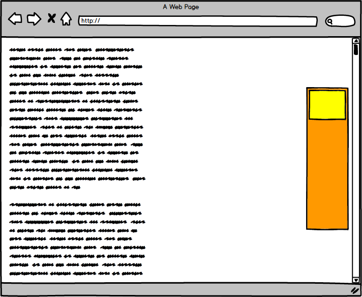

# Kế hoạch đào tạo cơ bản 1 tháng

Đề bài : [Tuần 1](#tuần-1) - [Tuần 2](#tuần-2) - [Tuần 3](#tuần-3) - [Tuần 4](#tuần-4)

## Tuần 1
- Mục tiêu kiến thức
  - HTML5 & CSS3
  - SASS, Gulp
  - Bootstrap 4, components của BS4. Modular trong css

- Lý thuyết : 
  - Đọc qua các thẻ HTML5, CSS3. Đọc 1 số bài so sánh với HTML4 CSS2
  - Các thuộc tính liên quan đến layout http://learnlayout.com/toc.html
  - Cú pháp SASS
  - Cách dùng `Gulp` để compile file `sass` sang `css`
  - Cấu trúc project có dử fụng sass, html cơ bản
  - Modular trong css http://thesassway.com/advanced/modular-css-an-example
  - Bootstrap4 : Các `component` của BS4, các Helper, utilities class, ... tìm hiểu kỹ 1 module bất kỳ để xem BS4 áp dụng modular ntn : lưu ý class module, class biến thể, sự phụ thuộc về mặt cấu trúc trong 1 module. 
    - Tham khảo phần phân chia style cho trang document của bootstrap https://github.com/twbs/bootstrap/tree/v4-dev/assets/scss với thự tự import các file scss trong `docs.scss`
    - Task compile css cho trang document https://github.com/twbs/bootstrap/blob/v4-dev/package.json#L23
  - Xem cấu trúc html của các module trong 1 trang html đầy đủ qua ví dụ https://v4-alpha.getbootstrap.com/examples/
  - Cấu trúc 1 project chỉ gồm html/css/js có sử dụng gulp để compile sass https://github.com/colombo-trainee/bootstrap4-scss-gulp-starter-kit.git

- Thực hành
  - Sử dụng BS4 để làm lại trang https://s.bootsnipp.com/iframe/Gzorl

- Note : khi đọc phần lý thuyết nên tự viết các demo để test thực tế trên máy.

## Tuần 2
- Mục tiêu kiến thức
  - Jquery, jquery plugin, Javascript
  - ES5 ES6
  - Nodejs

- Lý thuyết:
  - Jquery, các hàm jquery hỗ trợ, selector, các hàm để dom manipulate, các hàm liên quan animation
  - Chọn 1 plugin jquery để sử dụng 
  - Cách tạo jquery plugin
  - Javascript cơ bản, Object vs Array trong javascript, thao tác với string trong javascript
  - ES6 và sự khác biệt với ES5
  - Cú pháp nodejs, cài đặt, modules, ...
  - Đọc qua [Nodejs best practices](https://github.com/i0natan/nodebestpractices#1-project-structure-practices)

- Thực hành 1
  - Tạo 1 jquery plugin để áp dụng hiệu ứng cho 1 thành phần div bên trong 1 div cha như hình vẽ

  
  - div cha có chiều cao được định sẵn, khi kéo trình duyệt lên nhưng chưa qua điểm cuối của div cha thì div con trôi dọc theo và cố định cách viền trên của trình duyệt 1 khoảng `a px`

  
  - khi kéo trang web đi qua điểm cuối của trình duyệt thì cả 2 div đều bị kéo theo

  
  - Giả sử div con có id `almost-show` thì chỉ cần gọi
  ```
  $('#almost-show').inner_float({
    top:10px
  });
  ```

- Thực hành 2
  - Tên : Remote browser
  - Tạo 1 server bằng nodejs đảm nhiệm nhiệm vụ vào 1 trang web được định sẵn và trả về thông tin được yêu cầu
  - Request :
  ```
  {
    url : 'http://google.com',
    request : 'html,header,cookie',
    script : {}
  }
  ```
  - Response lỗi 

  ```
  {
    success : false,
    message : 'Không thể khởi động selenium/phantomjs/puppetee'
  }
  ```

  - Response OK 
  ```
  {
    success : true,
    message : 'OK',
    data : {
      cookie : '',
      html : '',
      header : []
    }
  }
  ```

  - Sử dụng nodejs kết nối với Chromium qua `puppetee` để truy cập và lấy các thông tin cần thiết.
  - Script để điều khiển trình duyệt trước khi lấy thông tin, ví dụ : login rồi mới lấy kết quả. (Option)
  - Tham khảo (chỉ sử dụng puppetee): 
    - https://github.com/GoogleChrome/puppeteer
    - http://casperjs.org
    - http://phantomjs.org
  

## Tuần 3
- Mục tiêu kiến thức
  - PHP 5.6 7, Design pattern trong PHP
  - Composer, khởi tạo 1 package
  - Thuật toán, cấu trúc dữ liệu

- Lý thuyết :
  - Cú pháp PHP cơ bản, cách đọc PHP document, tra hàm, ...
  - Hướng đối tượng trong PHP
  - PHP5 vs PHP7
  - [Design pattern](https://github.com/kamranahmedse/design-patterns-for-humans), [design pattern trong PHP](https://github.com/domnikl/DesignPatternsPHP)
  - Xem qua PHP-FIG, xem PSR-4 là gì
  - Composer là gì, để làm gì, cú pháp file composer.json, cách dùng. Phar là gì. Thử xem code trong file composer/composer.phar. Chú ý `require` vs `require-dev`, cách khai báo `autoload` và composer tạo file `vendor/autoload.php` như thế nào, sẽ autoload như thế nào với từng loại autoload
  - Cách tạo 1 php package với composer, xem cấu trúc cơ bản của 1 php package [PHP skeleton](https://github.com/colombo-trainee/skeleton)
  - PHPUnit, khởi tạo phần test cho 1 package như thế nào(dùng `phpunit --generate-configuration`)
  - Xem cấu trúc 1 số package trong PHP https://packagist.org/
  - Cấu trúc dữ liệu, thuật toán với PHP [PHP Data Structure and Algorithms](https://github.com/mirahman/PHP-Data-Structure-and-Algorithms)

- Thực hành 1:
  - Tạo 1 PHP package với composer hỗ trợ thao tác với URL
  - Tên package `ten_trainee/url_helper`
  - Tính năng:
    - Valid 1 chuỗi có là url hợp lệ không
    - Nối 1 path với 1 base url. Ví dụ `http://google.com/a/` nối với `xyz.html` thành `http://google.com/a/xyz.html` nhưng nối với `/xyz.html` thành `http://google.com/xyz.html`
    - Lấy ra được thông tin : protocol, port, domain
    - Viết file test sử dụng PHPUnit
  - Viết file `readme.md` giới thiệu, hướng dẫn cách sử dụng
  - Submit lên Packagist sau khi hoàn thiện các tính năng trên
  - Cập nhật file `readme.md` với cách cài đặt bằng composer
- Thực hành 2:
  - Chọn 2 thuật toán bất kỳ trong đó có 1 thuật toán về đồ thị để trình bày, giải thích cho các intern khác trong 1 buổi thuyết trình. Danh sách tại [PHP Data Structure and Algorithms](https://github.com/mirahman/PHP-Data-Structure-and-Algorithms)
  - Chú ý với mỗi thuật toán cần trình bày : Tên, Ứng dụng, Vấn đề(input/output), Tư tưởng chung của giải pháp, Trình bày các bước của giải pháp trên code.
  - Mục tiêu : Đọc hiểu và giải thích cho người khác hiểu.

## Tuần 4
- Mục tiêu kiến thức
  - Command line, queue
  - Laravel
  - Webpack 

- Lý thuyết :
  - Command line trong Linux/Windows, cách truyền biến vào command, phân biệt argument/option/input stream. Khái niệm stdin, stdout, stderr, signal.
  - Chế độ command line của PHP, cách truyền argument/option vào trong code php khi sử dụng chế độ command
  - Queue : tìm hiểu khái niệm queue, worker, dispathcher trong `Message Queue/Worker System`
  - Nếu chưa dùng Laravel thì làm theo 1 tutorial đơn giản bất kỳ để biết Laravel là gì. Sơ qua bố cục code, cách làm việc. Khuyến nghị [Laravel 5.4 From Scratch](https://laracasts.com/series/laravel-from-scratch-2017) hoặc [Realtime Chat Demo with Laravel 5.4, VueJS, and Pusher](https://github.com/jplhomer/laravel-realtime-chat-demo)
  - Đọc qua 2 3 lượt phần [Architecture Concepts](https://laravel.com/docs/5.5/lifecycle)
  - Các phần khác đọc 1 lượt, chú ý phần [Package Development](https://laravel.com/docs/5.5/packages)

- Thực hành 1:
  - Fork 1 bản [Realtime Chat Demo with Laravel 5.4, VueJS, and Pusher](https://github.com/jplhomer/laravel-realtime-chat-demo) sau đó clone về máy và cài đặt để chạy được trên máy cá nhân(chat được realtime).
  - Bài [tutorial](https://jplhomer.org/2017/01/building-realtime-chat-app-laravel-5-4-vuejs/), xem các lần commit và sự thay đổi để biết được người ta sửa gì để giải quyết vấn đề [commits](https://github.com/jplhomer/laravel-realtime-chat-demo/commits/master)
  - Nâng cấp project lên bản Laravel 5.5.
- Thực hành 2:
  - Sử dụng [laravel echo server](https://github.com/tlaverdure/laravel-echo-server) thay cho Pusher.
  - Hỗ trợ nhiều room khác nhau : Ví dụ truy cập link `http://example.com/chat/room1` hệ thống tự động tạo `room1` nếu chưa có(chỉ tự động tạo nếu user hiện tại có `id` bằng 1), còn lại sẽ giống như hiện tại.
  - User có `id` bằng 1 có thể xóa tin nhắn của bất kỳ ai. Những người khác chỉ có thể xóa tin nhắn của mình.

